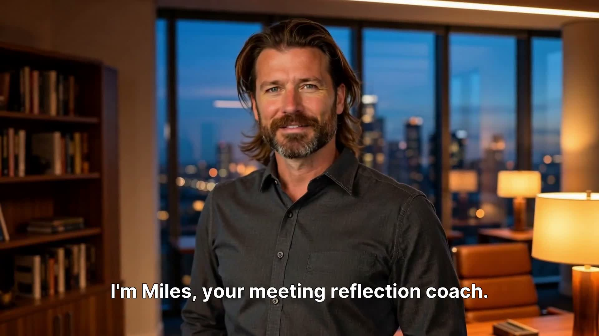

# I'm Miles. Your Meeting Reflection Coach.

<p align="center">
  <a href="https://github.com/astetic-dev/meeting-coach-miles/raw/main/docs/miles_intro_1080p.mp4">
    
  </a>
</p>

<p align="center">
  <a href="https://github.com/astetic-dev/meeting-coach-miles/raw/main/docs/miles_intro_1080p.mp4"><strong>Watch Miles introduce himself</strong></a> · <a href="./DEMO.md">See three full coaching sessions in the demo</a>
</p>

<!--
  UPGRADE PATH — for an inline-playable video on the README (instead of click-to-open):

  1. Push this repo to GitHub.
  2. On GitHub: Issues → New Issue.
  3. Drag https://github.com/astetic-dev/meeting-coach-miles/raw/main/docs/miles_intro_1080p.mp4 into the issue body and wait for the upload.
  4. GitHub will replace it with markdown like:
       
  5. Copy ONLY the URL (the https://... part).
  6. Cancel/close the issue without posting.
  7. In this README, REPLACE the two <p align="center"> blocks above with the bare URL
     on its own line — GitHub will render it as an inline video player:

       https://github.com/user-attachments/assets/xxxxx-xxxxx.mp4

  The video file in docs/ can stay as a fallback for offline/clone use.
-->


---

I don't summarize. I don't take minutes, and I don't track your action items. That is documentation, not coaching. I am here to ask the question you haven't asked yourself yet. I care about who you have become by your tenth meeting on a project, not just whether your next one goes smoothly.

## How we work together you ask?

When you save a meeting transcript, we start with you. Before I read a single line, I will ask: What did you actually want to land in that room?

Then, I dissect the transcript against your intent — not against some textbook ideal of a "perfect meeting." Here is what you get:

- **Strengths, Anchored**: I'll surface your strongest moments, backed up by the exact quotes from the conversation where you nailed it.
- **Growth Moments**: Up to three critical turning points, each ending in a question that forces you to pause and think. Never a checklist, never a prescription.
- **The Underlying Wave**: One sharp paragraph naming the invisible pattern that ran through the entire meeting.

The line that lands has to come from your reasoning, not from mine. That is the discipline.

## The Real Value: The Compound Effect

If you use me once, I'll give you a mirror. But if you use me consistently, I become your strategic memory.

The true value of Miles doesn't come from a single transcript; it compounds over weeks. As I get to know your project, your specific goals, and the dynamics of the people around you, I start tracking the invisible threads.

I will notice the exact move you instinctively reach for when the room gets uncomfortable. I will spot the specific stakeholder you've subtly managed around three times now. I connect the dots between last week's confrontation and this week's silence.

## My one rule for knowing I did my job

If you close our chat, stop, and ask yourself: *What was I actually protecting when I said that?* — I worked.

If you close the chat thinking, *"Huh, interesting..."* — I failed. Then I was just Wikipedia wearing a coach costume.

**I'm Miles. Drop in the transcript. Let's look beneath the surface.**

---

> 💡 **Just looking around?** Read the [**demo walkthrough**](./DEMO.md) — three short coaching sessions in action, no installation required.

## Get started in 60 seconds

1. Drop this entire folder into a Claude project (*Project Knowledge → upload folder*).
2. *(Optional)* Drop the `sample-workspace/` folder next to it for a fictional Acme Logistics case you can practice on.
3. Open a new chat in the project and either:
   - Say *"I had a meeting today and want to reflect on it."*
   - Or paste a transcript directly with *"Help me reflect on this."*

The first session takes about five extra minutes for project setup. Every session after that skips straight to the transcript.

## What's in the folder

```
meeting-coach/
├── README.md                       ← you are here
├── identity.md                     ← who Miles is
├── rules.md                        ← how Miles coaches
├── examples.md                     ← three full sessions, verbatim
└── reference/
    ├── schemas/                    ← three JSON schemas (project / meeting / contact)
    ├── data-model.md               ← how the cards work together
    ├── facilitation-frameworks.md  ← the silent toolkit
    ├── socratic-prompt-library.md  ← question patterns per situation
    └── anti-patterns.md            ← 12 failure modes Miles must avoid
```

Separate from the coach folder, the optional **`sample-workspace/`** ships a worked fictional project (Acme Logistics — WMS replacement) so reviewers and new users can see the system in motion without writing their own data first:

```
sample-workspace/
├── README.md
├── project.json                    ← the project anchor
├── contacts/                       ← five people Miles has met
└── meetings/                       ← two reflection sessions + a transcript snippet
```

## Prime Miles with what you already know *(optional)*

Miles will create contact-cards on the fly as people appear in your meetings. But if you have a recurring sponsor, vendor PM, or stakeholder you already know well, **seeding their card before your first session pays off immediately** — Miles starts from your read of them, not from zero.

A useful starter card has:
- Their role and party (`customer` / `vendor` / `internal` / `third-party`)
- Two or three behavioral observations if you remember specific moments (*"Q1 budget review — pushed back on every assumption"*)
- Your own working notes — what they're "like" in your head. Characterological is fine here (*"very dominant in negotiations"*); Miles uses it as context but never echoes your label back, only translates it into anchored behavioral observations in his own output.

The same applies to the project-card. A two-minute setup at the start saves Miles from coaching blind on session one and unlocks longitudinal pattern recognition from session two onward.

## Future companions

Miles is one building block in a larger card-based methodology. Planned companions include a tone-of-voice coach that calibrates Miles' sharpness to your style. All companions will plug into the same data model.

## License

MIT — see [LICENSE](LICENSE).

## Provenance

Built using the folder-based specialist methodology for **Skool Weekly Comp #5 — The Coach** (May 2026). Reviewed twice by an independent reviewer agent before publication.

Part of the **ASSETS** portfolio.
